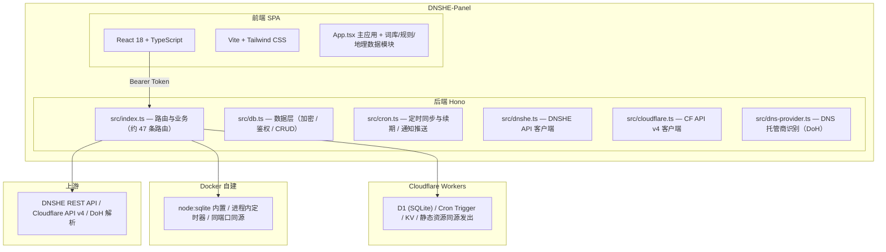

# 🌐 DNSHE-Panel

> DNSHE 多账号域名集控面板 —— 在 [DNSHE](https://my.dnshe.com) 官方面板之外，给「一次管一二十个账号、上百个域名」的场景补一套集中式工作台

[](https://github.com/shiranzby/DNSHE-Panel/actions/workflows/docker.yml)
[](LICENSE)

DNSHE-Panel 基于 [lioil522/dnshe-manager](https://github.com/lioil522/dnshe-manager) 二次开发。上游已经提供了域名资产看板、Cloudflare 管理、定时同步与续期、通知推送和自建版 Node 适配；本仓库在它之上补齐了概览页指标卡与账户配额、域名注册查重、运行日志、API 密钥集中管理、域名助力与助力记录，并修掉了一批请求竞态与健壮性问题。同一套后端代码同时支持 **Cloudflare Workers** 与 **Docker 自建** 两种部署形态。

---

## ✨ 功能特性

### 资产管理

- **多账号管理** — 绑定多个 DNSHE API Key，跨账号统一管理；支持单条与批量粘贴（逐行 `Key Secret`、逗号/空格/Tab 分隔，亦兼容 JSON 数组）
- **域名列表** — 按账号分组折叠，支持账号筛选与「系统默认 / 外部 DNS」类型筛选；每张卡直接显示注册/到期时间、当前 DNS 服务商、认证状态；账号徽章给出「共 N 个域名（系统默认: x | 外部DNS: y）」的分布
- **概览看板** — 12 张指标卡分三组（域名资产 / 账号与助力 / 配额），列数 1–4 自适应且可记忆
- **账户配额** — 每账号的基础额度、邀请加成、已用与可用配额汇总，支持按需隐藏账号

### 解析与 Cloudflare

- **DNS 解析管理** — 面板内增删改 DNS 记录（A / AAAA / CNAME / MX / TXT 等），支持批量添加与批量修改
- **解析线路** — 识别支持按线路解析的根域，行内选择线路
- **Cloudflare 管理** — 独立标签页绑定 Cloudflare 账号（绑定即在线校验 Token、别名自动取账号名），自动同步 zones；zone 卡支持全部记录类型的增删改与批量操作、橙色云代理开关、控制台深链
- **跨站交叉提示** — DNSHE 域名若 NS 已指向 Cloudflare 且已绑定账号，一键跳转定位到对应的 zone 解析面板

### 注册与助力

- **精准单域名查重** — 输入即查，走多账号并发
- **规则多域名查重** — 词库标签（`{字母}` / `{地名城市}` / `{网站App}` …）自由组合、可编辑词库、官方保留前缀排除名单、顺序检测（进位递增）、断点续查、命中查重池自动跳过
- **域名助力** — 生成/使用助力码把域名升级为永久；助力前弹出确认窗列出将使用的账号与消耗次数，可取消勾选（自己的号给自己的域名助力必然失败）；助力明细与最近助力记录（按助力码聚合、每页 10 条）

### 自动化与安全

- **自动续期** — 定时扫描即将到期的域名并自动续期，无人值守
- **配额感知的同步** — 单次调用受 Workers 免费版「50 个子请求」限制，同步按**域名**预算分批并把剩余部分交回前端续跑，不静默丢账号
- **通知推送** — 钉钉 / 飞书 / 企业微信 / Server酱 / Telegram / 自定义 Webhook / **邮箱 SMTP**
- **安全认证** — 用户名 + 密码（PBKDF2 加盐哈希），可选 2FA (TOTP)；AES-GCM 加密存储 API Secret、API 密钥 Secret 与 2FA 密钥
- **API 密钥页** — DNSHE 官方 API 密钥（key/secret）集中管理，Secret 加密保存、按需解密查看，支持批量创建与有效期展示；**打开即出结果**：先读本地库快照（0 次上游请求），实时状态由后台逐账号补齐，全程不整屏转圈
- **运行日志** — 分类（同步/续期/系统）与等级筛选，分页浏览
- **主题与国际化域名** — 深色/浅色主题、刷新无闪白；Punycode 域名的中英互转与显示

### 工程化

- **增量复核 + 子请求预算** — 上游 `updated_at` 没变过的域名不再重复查解析记录（稳态每账号只花 1 次子请求），配合按域名分档的预算，手动同步与定时任务都不会撞上 Workers 免费版「单次调用 50 个子请求」的上限（详见 [Worker 子请求上限的处理](#-worker-子请求上限的处理)）
- **失败不再静默** — 同步失败会写进运行日志，不再出现「账号凭空消失但日志空白」

---

## 🏗️ 架构概览



前端与后端在**同一个 Worker** 里：静态资源由 Cloudflare 直接发出（不进 Worker、不计 Worker 请求数），只有 `/api/*` 才执行脚本。因此没有 Pages 项目、没有第二个域名，也不需要配 CORS。

---

## 🚀 部署方式

### 方式一：Cloudflare Workers — GitHub Actions 一键部署（推荐）

Fork 仓库后配置 Secrets，推送到 `main` 即自动部署。

> **ℹ️ 本仓库的 `deploy.yml` 默认处于停用状态**（作者不在 GitHub 上保存 Cloudflare 凭据）。
> 需要云端自动部署时，到 `Actions` → `Deploy to Cloudflare` → `Enable workflow` 打开即可，
> 或直接在本地跑 `npx wrangler deploy`（见方式二的自建版说明，Workers 同样适用）。

#### 1. 获取 Cloudflare 凭据

登录 [Cloudflare Dashboard](https://dash.cloudflare.com/)：

- **Account ID**：任意域名的「概述」页右侧栏
- **API Token**：「我的个人资料」→「API 令牌」→「创建令牌」，需要以下权限：

| 权限 | 说明 |
|------|------|
| `Workers Scripts:编辑` | 部署 Worker（后端脚本 + 前端静态资源） |
| `D1:编辑` | 自动创建 / 绑定 D1 数据库 |
| `Workers KV Storage:编辑` | 自动创建 / 绑定 KV 命名空间（域名助力缓存） |
| `Workers Routes:编辑` | 自动检测自定义域名 |
| `Zone:读取` | 查询域名路由 |

#### 2. 配置 GitHub Secrets

`Settings` → `Secrets and variables` → `Actions` → `New repository secret`：

| Secret 名称 | 是否必填 | 说明 |
|-------------|---------|------|
| `CLOUDFLARE_API_TOKEN` | ✅ 必填 | 上一步创建的 API Token |
| `CLOUDFLARE_ACCOUNT_ID` | ✅ 必填 | Cloudflare 账户 ID |
| `CLOUDFLARE_D1_DATABASE_ID` | 可选 | D1 数据库 ID，留空按 `wrangler.toml` 里的 `database_name` 查找，找不到就新建 |
| `CLOUDFLARE_KV_NAMESPACE_ID` | 可选 | KV 命名空间 ID，留空沿用 `wrangler.toml` 里那个（属于本账号时）或新建 |
| `AES_KEY` | 可选 | 加密密钥，留空首次部署自动生成 |
| `ADMIN_TOKEN` | 可选 | 应急后门令牌 |
| `WEBHOOK_URL` | 可选 | 通知推送地址 |
| `ALLOWED_ORIGIN` | 可选 | CORS 白名单。前后端同源，正常部署**不需要** |

#### 3. 触发部署

- 推送到 `main`（自动触发），或
- `Actions` → `Deploy to Cloudflare` → `Run workflow`

工作流会自动完成：绑定 D1 / KV（按需创建并写回 `wrangler.toml`）→ 检测自定义域并关闭 workers.dev → 构建前端 → 一次 `wrangler deploy` 同时上传后端与静态资源 → 生成/同步 `AES_KEY` → 同步可选 Secrets。

> **💡 首次部署后**，访问地址在该次运行的**摘要页**顶部。打开它，在登录页自行设置管理员用户名与密码。
>
> ⚠️ 启用后，`deploy.yml` 里 **`main` 分支的 push 会自动部署**。如果只是提交代码、不想发版，请给 commit message 加 `[skip ci]`。

### 方式二：Cloudflare Workers — 本地 wrangler 手动部署

不想把 Cloudflare 令牌交给 GitHub Actions 时用这条：

```bash
git clone https://github.com/shiranzby/DNSHE-Panel.git
cd DNSHE-Panel

npm install
npm --prefix frontend install

# 🔴 关键：必须带 VITE_API_BASE_URL，缺了线上登录会直接报「未配置后端地址」
#    （frontend/vite.config.ts 现在会在缺变量时让构建失败，避免静默上线；
#      MSYS_NO_PATHCONV=1 也不能省 —— Git Bash 会把裸斜杠 / 改写成 Git 安装根目录）
cd frontend
MSYS_NO_PATHCONV=1 VITE_API_BASE_URL=/ npx vite build
cd ..

# 先在 wrangler.toml 里改 name 与 [[d1_databases]] / [[kv_namespaces]] 的 id
export CLOUDFLARE_EMAIL="你的 Cloudflare 邮箱"
export CLOUDFLARE_API_KEY="你的 Global API Key"
export CLOUDFLARE_ACCOUNT_ID="你的 Account ID"
npx wrangler deploy

# 注入加密密钥（只需一次；换密钥会让库里已加密的 Secret 全部解不开）
openssl rand -hex 32 | npx wrangler secret put AES_KEY
```

自定义域用 `PUT /accounts/{account_id}/workers/domains` 挂载（Cloudflare 会自动建 `AAAA → 100::` 记录并签发证书），比手工配 A 记录 + Workers 路由少两步。

### 方式三：Docker 自建

```bash
curl -O https://raw.githubusercontent.com/shiranzby/DNSHE-Panel/main/docker-compose.yml
docker compose up -d
# 浏览器打开 http://<服务器IP>:8787，首次进入自行设置管理员用户名与密码
```

更新：`docker compose pull && docker compose up -d`

> **⚠️ 大陆网络提示：** `ghcr.io` 拉取可能很慢，可在 `.env` 中设置镜像站：
> `IMAGE_REPO=ghcr.nju.edu.cn/shiranzby/dnshe-panel`

镜像为 `amd64` / `arm64` 多架构；运行时镜像不含 `node_modules`（后端由 esbuild 打包成单文件）；以 uid 1000 非 root 运行；内置 HEALTHCHECK。

---

## ⚙️ 环境变量

所有变量均为**可选**，全部留空也能正常启动。

| 变量 | 说明 | 默认值 |
|------|------|--------|
| `AES_KEY` | AES-GCM 加密密钥，用于加密 API Secret、API 密钥 Secret 与 2FA 密钥 | 自动生成并保存到 `/data/aes.key` |
| `ADMIN_TOKEN` | 应急后门令牌，忘记密码时的兜底登录方式（也接受其对应的 TOTP 动态码） | 不启用 |
| `WEBHOOK_URL` | 通知推送地址 | — |
| `WEBHOOK_TYPE` | 推送类型：`dingtalk` / `feishu` / `wecom` / `serverchan` / `custom` / `email` | — |
| `ALLOWED_ORIGIN` | CORS 允许来源（逗号分隔）。自建版前后端同源，无需配置 | — |
| `DEFAULT_API_KEY` | 首次启动自动绑定的 DNSHE API Key | — |
| `DEFAULT_API_SECRET` | 首次启动自动绑定的 DNSHE API Secret | — |
| `DEFAULT_API_ALIAS` | 默认账号别名 | — |
| `IMAGE_TAG` / `IMAGE_REPO` | 自建镜像版本与地址 | `latest` / `ghcr.io/shiranzby/dnshe-panel` |
| `CRON_UTC_HOUR` / `CRON_UTC_MINUTE` | 自建版定时任务执行时刻（UTC） | `2` / `0`（北京时间 10:00） |
| `DISABLE_CRON` | 设为 `1` 关闭每日自动同步与续期 | — |
| `TZ` | 容器内日志时区 | `Asia/Shanghai` |

> **⚠️ 备份提醒：** `AES_KEY` 必须与数据库一起备份。密钥丢失后，库中加密的 API Secret 与 2FA 密钥将无法解密。
>
> **SMTP 说明：** 邮箱通知的 SMTP 账号在**面板设置页**里配置（不是环境变量）。Workers 运行时通过 `cloudflare:sockets` 的 `connect({ secureTransport: "on" })` 走隐式 TLS 直连 465 端口，实测 QQ 邮箱可正常发信。

---

## 📁 项目结构

```
DNSHE-Panel/
├── src/                        # 共享业务代码（Workers 与自建版共用）
│   ├── index.ts                #   Hono 路由与 API 处理（约 47 条路由，含鉴权中间件）
│   ├── db.ts                   #   数据库管理器（加密、鉴权、CRUD、缓存）
│   ├── cron.ts                 #   定时同步与续期、Webhook/SMTP/Telegram 推送
│   ├── dnshe.ts                #   DNSHE API 客户端
│   ├── cloudflare.ts           #   Cloudflare API v4 客户端（zone 与解析记录）
│   ├── dns-provider.ts         #   DNS 托管商识别（DoH）+ 增量复核计划（planDnsChecks）与有界并发
│   └── punycode.ts             #   国际化域名编码
│
├── server/                     # 自建版专属（Node 运行时适配）
│   ├── index.ts                #   Node 入口（env 组装、定时器、AES 密钥自举）
│   ├── d1-sqlite.ts            #   D1 → SQLite 适配层（node:sqlite）
│   ├── d1-sqlite.test.ts       #   适配层自检（21 项，含增量同步的时间戳语义）
│   └── static.ts               #   静态资源服务（SPA 兜底、ETag、缓存头）
│
├── frontend/                   # 前端（React + TypeScript + Vite）
│   ├── src/
│   │   ├── App.tsx             #   主应用（10 个标签页）
│   │   ├── rulegen.ts          #   查重规则解析与候选生成
│   │   ├── wordbanks.ts        #   可编辑词库
│   │   ├── dnsrecords.ts       #   DNS 记录类型定义
│   │   ├── geodata.ts / zipcodes.ts / pinyin.ts / enwords.ts
│   │   └── punycode.ts         #   前端侧 Punycode
│   ├── public/_headers         #   静态资源安全响应头
│   └── vite.config.ts
│
├── .github/workflows/
│   ├── docker.yml              #   自建镜像构建与发布（amd64 + arm64）
│   └── deploy.yml              #   Cloudflare Workers 部署（后端 + 前端静态资源）
│
├── schema.sql                  # 数据库表结构
├── Dockerfile                  # 三阶段构建（前端 → 后端 → 运行时）
├── docker-compose.yml
├── wrangler.toml               # Cloudflare Workers 配置（含 [assets] 静态资源托管）
├── .env.example
└── package.json
```

---

## 🛠️ 本地开发

### 前置要求

- **Node.js** ≥ 22.5（自建版用内置 `node:sqlite`；自检脚本出现 `ExperimentalWarning` 属正常）
- **npm**
- **Wrangler** ≥ 4（已在 devDependencies）

### Cloudflare Workers 模式

```bash
npm install
npm --prefix frontend install

# ⚠️ 先构建一次前端：wrangler.toml 的 assets.directory 指向 frontend/dist，
#    该目录不存在时 wrangler dev / deploy 会直接报错退出。
#    用 build:selfhost（读 .env.selfhost，已知同源基准地址）；直接跑 build 会因为
#    缺 VITE_API_BASE_URL 而被 vite.config.ts 拦下 —— 这是故意的，见「改了前端代码」。
npm --prefix frontend run build:selfhost

# 启动后端（默认 8787，同时把 frontend/dist 当静态资源发出）
npm run dev

# 改前端时另起 Vite 开发服务器（自动代理 /api 到 8787）
npm --prefix frontend run dev
```

### 自建模式

```bash
npm run build:node       # esbuild 打包为单文件
npm run start:node
```

---

## 📝 数据库结构

| 表名 | 用途 |
|------|------|
| `accounts` | 账号（provider、别名、API Key / Cloudflare Token、加密后的 Secret） |
| `domains_cache` | 域名缓存（状态、到期时间、NS、解析记录三态、续期记录、`remote_updated_at` 增量复核时间戳） |
| `logs` | 系统运行日志（同步 / 续期 / 鉴权 / 系统分类） |
| `cache` | 上游响应缓存（配额、查重池等，带过期时间） |
| `settings` | 面板设置（含 SMTP 配置、通知渠道等，键值对） |

D1 与自建版用的都是 SQLite，表结构完全一致，可直接迁移（**`AES_KEY` 必须保持一致**）。

---

## 🚦 Worker 子请求上限的处理

Cloudflare Workers 免费版对**单次调用**有 50 个子请求的硬上限，`fetch` 以及 KV / D1 等绑定调用都计入。上游的实现是「一次性遍历所有账号 + 每个域名单独查一次 DNS 记录」，账号一多必然超限；超限抛出的 `Too many subrequests by single Worker invocation` 又会被账号级 `try/catch` 吞掉，循环里后面的账号直接跳过 —— 现象就是**部分账号的域名凭空消失，日志里却看不出原因**（上游 [issue #8](https://github.com/lioil522/dnshe-manager/issues/8)）。

本仓库用四层约束把单次调用的子请求数压回上限以内：

| 路径 | 约束方式 | 单次开销 |
|------|----------|----------|
| **增量复核**（所有同步路径共用） | 上游 `subdomains/list` **免费**带回每个域名的 `updated_at`，而三态完全由该域名区域内的解析记录推导 ⇒「上游 `updated_at` 与上次复核时一致」等价于「三态没变」，那一次 `dns_records/list` 直接省掉。判据（`planDnsChecks`）：新域名 → 时间戳变了 → 缓存里的状态不是三态 → 本地行超过 7 天没被写过（兜底） | **稳态每个账号 1 次**（只有列表页），冷启动或域名改动后才按域名付费 |
| 手动全量同步 `POST /api/domains/sync` | **按域名预算分批**：`SYNC_SUBREQUEST_BUDGET = 34` 是「本次调用允许消耗的网络子请求数」，同步与续期共享同一份预算；被截断的域名回 `pending`、账号回 `remaining`，前端按 `done` 接力直到清空 | ≤ 34 |
| 定时任务（Workers Cron / 自建版 node-cron） | 同一份预算，从持久化游标 `sync_cursor` 起**顺序尽量多扫**（不再是每轮只扫一个账号）；预算见底就把剩下的账号留给下一轮，游标正好停在断点 | ≤ 34 |
| 解析线路的 NS 查询 `POST /api/dnshe/ns-lookup` | **限额 + 缓存**：单次最多查 20 个根域名（`NS_MAX_ROOTS = 20`，每个最坏 2 次子请求），结论缓存 30 天 | ≤ 40 |
| **密钥页首屏** `GET /api/keys?source=local` | **先读本地库快照**：每次全量刷新都把上游密钥清单登记进 `api_keys` 表（登记时不带 Secret，不会覆盖已保存的密文）⇒ 打开页面直接读库出结果，一个上游请求都不发；实时状态（请求次数/最后使用）由前端在后台逐账号补齐 | **0 次上游请求**（只有 D1 查询） |

线上实测（6 个 DNSHE 账号 + 1 个 Cloudflare 账号，共 50 个域名 / 29 个 zone）：

| 场景 | 轮次 | 子请求 | 复核域名 | 用时 |
|------|------|--------|----------|------|
| 冷启动（`remote_updated_at` 全空） | 2 轮（34/34 → 24/34） | 58 | 50 | 28s |
| 稳态 | 1 轮 | **7**（每账号 1 次） | 0 | 5s |

> 复现脚本：`dnshe-deploy/.apitmp/verify-incremental-sync.py` —— 它会先把 `remote_updated_at` 清空来制造冷启动现场（可逆，下一次同步会原样填回），再跑稳态，最后按六条判据断言。

**单账号域名超限**（原先的已知边界）已解决：预算落在**域名**这一层，不再是账号层。所以哪怕某个账号有几百个域名，一次调用也只复核预算内的那部分，剩下的走 `pending` / `remaining` 交给前端或下一轮 cron 继续 —— 不会再出现「后面的账号被静默跳过」。代价是极端情况下需要多次调用才能覆盖完全部域名，进度以前端按钮上的「同步中 x/y」呈现。

定时任务同样不再受账号数限制：稳态下每个账号只要 1 次子请求，所以每小时一轮就能把全部账号过一遍（早先是「每轮一个账号」，6 个账号要 6 小时才轮到一圈）。

---

## ❓ 常见问题

### Cloudflare 版与自建版有什么区别？

| | Cloudflare Workers | Docker 自建 |
|---|---|---|
| 数据库 | D1 (SQLite) | Node 内置 `node:sqlite` |
| 定时任务 | Cron Trigger | 进程内定时器 |
| 前端发布 | 同一个 Worker 的静态资源 | 同端口同源发出 |
| CORS | 同源，无需配置 | 同源，无需配置 |
| 运维 | Cloudflare 托管 | 自行运维 |

### 同步域名时有的账号「凭空消失」？

不是消失，是撞上了 Workers 免费版**单次调用 50 个子请求**的上限 —— 每个域名要单独查一次解析记录，超限部分会被静默丢弃，而异常又被账号级 `try/catch` 吃掉。本项目现在有两道保险：① **增量复核** —— 上游 `updated_at` 没变过的域名根本不发那次请求（稳态每账号只花 1 次）；② **按域名预算分批** —— 截断的域名回 `pending`、账号回 `remaining`，前端自动接力直到 `done: true`。手工触发「同步所有账号」时等按钮从「同步中 x/y」恢复即可。

### 改了前端代码，构建成功但线上还是旧界面？

先对比线上 `index.html` 里的资源哈希与你本地 `frontend/dist/assets/` 下的文件名。`wrangler deploy` 有可能打印「No updated asset files」却仍在上传旧产物；以「哈希变了 + 连续两次取到同一个哈希」为准。另外**不要漏掉 `VITE_API_BASE_URL=/`**：漏了会让登录直接报「未配置后端地址」（`frontend/vite.config.ts` 现在会直接让构建失败，避免静默上线）。⚠️ 在 Git Bash 里手写 `VITE_API_BASE_URL=/ npm run build` 同样会坏 —— MSYS2 会把裸斜杠改写成 Git 安装根目录，改用 `python dnshe-deploy/.apitmp/build-web.py` 或 `npm run build:selfhost`。

### 大陆访问 Cloudflare 版很慢怎么办？

先看 `https://<你的域名>/cdn-cgi/trace` 里的 `colo=`：`HKG`/`NRT`/`KIX`/`SIN` 属正常；落到 `AMS`/`FRA` 等欧洲节点就是路由异常。免费套餐不使用中国大陆网络，**没有任何开关能改变这个路由**，只能换部署位置（见方式二 / 方式三）。注意 `colo` 反映的是**发起请求那台机器**落到哪个 PoP，开代理测出来的结果与大陆访客无关。

### 忘记管理员密码怎么办？

配置了 `ADMIN_TOKEN` 就用它（或其对应的 TOTP 动态码）兜底登录；未配置则需清掉库中的管理员数据重新初始化。

### 助力时提示「本账号域名，已跳过」？

DNSHE 不允许自己的号给自家域名助力。在确认弹窗里把那个账号取消勾选即可 —— 排除名单会随请求一起发给后端，后端按账号 id 真正把它从候选里去掉（不只是界面上不算数）。

### 自动续期会处理 Cloudflare 的域名吗？

不会。Cloudflare 账号仅同步 zones 列表（有效期由注册商管理），不参与自动续期与配额统计；zone 的创建与删除请前往 Cloudflare 控制台。

### 绑定 Cloudflare 账号需要什么权限？

API Token 需含 `Zone:Read` 与 `Zone DNS:Edit`，作用范围建议覆盖要管理的域名。绑定时会调 `user/tokens/verify` 在线校验，无效或已禁用的 Token 不入库；同一 Cloudflare 账号不可重复绑定。

---

## 🙏 来源与致谢

本项目的整体骨架来自 [lioil522/dnshe-manager](https://github.com/lioil522/dnshe-manager)：Hono 路由、数据层、DNSHE / Cloudflare 客户端、定时同步与续期、通知推送、自建版 Node 适配，以及 Dockerfile 与 CI 工作流。

本仓库在其之上做的增量：

- 概览页指标卡重做，账户配额与失败数展示
- 域名注册查重（规则生成、批量扫描、暂停 / 继续 / 停止）
- 运行日志页
- API 密钥集中管理（表格化与增量缓存）
- 域名助力与助力记录（并行化、排除名单）
- Worker 子请求预算与定时同步的轮转调度
- 一批请求竞态、可选链空值与数值解析的健壮性修复

---

## 📄 许可证

[MIT](LICENSE)
